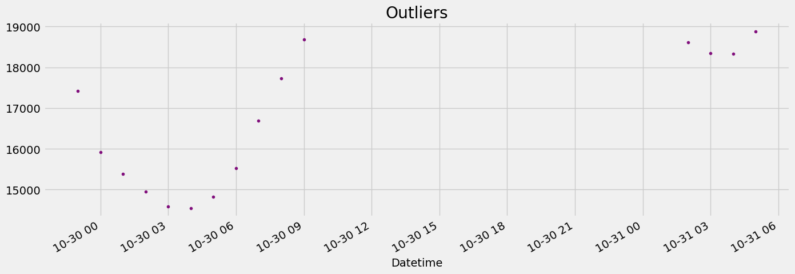

```python
import pandas as pd
import numpy as np
import matplotlib.pyplot as plt
import seaborn as sns

import xgboost as xgb
from sklearn.metrics import mean_squared_error
color_pal = sns.color_palette()
plt.style.use('fivethirtyeight')
```


```python
df = pd.read_csv('PJME_hourly.csv')
df['Datetime'] = df['Datetime'].astype(str)
df = df.set_index('Datetime')
df.index = pd.to_datetime(df.index)
```


```python
df.plot(style='.',
        figsize=(15, 5),
        color=color_pal[0],
        title='PJME Energy Use in MW')
plt.show()
```


    

    


# Outlier Analysis and removal


```python
df['PJME_MW'].plot(kind='hist', bins=500)
```


    <Axes: ylabel='Frequency'>


    

    


```python
df.query('PJME_MW < 19_000')['PJME_MW'] \
    .plot(style='.',
          figsize=(15, 5),
          color=color_pal[5],
          title='Outliers')
```


    <Axes: title={'center': 'Outliers'}, xlabel='Datetime'>


    

    


```python
df = df.query('PJME_MW > 19_000').copy()
```

# Reviewing: Train / Test Split


```python
train.head(2)
```


<div>
<style scoped>
    .dataframe tbody tr th:only-of-type {
        vertical-align: middle;
    }

    .dataframe tbody tr th {
        vertical-align: top;
    }

    .dataframe thead th {
        text-align: right;
    }
</style>
<table border="1" class="dataframe">
  <thead>
    <tr style="text-align: right;">
      <th></th>
      <th>PJME_MW</th>
    </tr>
    <tr>
      <th>Datetime</th>
      <th></th>
    </tr>
  </thead>
  <tbody>
    <tr>
      <th>2002-12-31 01:00:00</th>
      <td>26498.0</td>
    </tr>
    <tr>
      <th>2002-12-31 02:00:00</th>
      <td>25147.0</td>
    </tr>
  </tbody>
</table>
</div>


```python
train = df.loc[df.index < '01-01-2015']
test = df.loc[df.index >= '01-01-2015']

fig, ax = plt.subplots(figsize=(15, 5))
train.plot(ax=ax, label='Training Set', title='Data Train/Test Split')
test.plot(ax=ax, label='Test Set')
ax.axvline(pd.Timestamp('2015-01-01'), color='black', ls='--')
ax.legend(['Training Set', 'Test Set'])
plt.show()
```


    

    


# Time Series Cross Validation


```python
from sklearn.model_selection import TimeSeriesSplit

tss = TimeSeriesSplit(n_splits=5, test_size=24*365*1, gap=24)
df = df.sort_index()
```


```python
fig, axs = plt.subplots(5, 1, figsize=(15, 15), sharex=True)

fold = 0
for train_idx, val_idx in tss.split(df):
    train = df.iloc[train_idx]
    test = df.iloc[val_idx]
    train['PJME_MW'].plot(ax=axs[fold],
                          label='Training Set',
                          title=f'Data Train/Test Split Fold {fold}')
    test['PJME_MW'].plot(ax=axs[fold],
                         label='Test Set')
    axs[fold].axvline(test.index.min(), color='black', ls='--')
    fold += 1
plt.show()
```


    

    


# Forecasting Horizon Explained
**The forecast horizon is the length of time into the future for which forecasts are to be prepared. These generally vary from short-term forecasting horizons (less than three months) to long-term horizons (more than two years).**


```python
def create_features(df):
    """
    Create time series features based on time series index.
    """
    df = df.copy()
    df['hour'] = df.index.hour
    df['dayofweek'] = df.index.dayofweek
    df['quarter'] = df.index.quarter
    df['month'] = df.index.month
    df['year'] = df.index.year
    df['dayofyear'] = df.index.dayofyear
    df['dayofmonth'] = df.index.day
    df['weekofyear'] = df.index.isocalendar().week
    return df

df = create_features(df)
```

# Lag Features
- What was the target (x) days in the past.


```python
def add_lags(df):
    target_map = df['PJME_MW'].to_dict()
    df['lag1'] = (df.index - pd.Timedelta('364 days')).map(target_map)
    df['lag2'] = (df.index - pd.Timedelta('728 days')).map(target_map)
    df['lag3'] = (df.index - pd.Timedelta('1092 days')).map(target_map)
    return df
```


```python
df = add_lags(df)
```

## Train Using Cross Validation


```python
tss = TimeSeriesSplit(n_splits=5, test_size=24*365*1, gap=24)
df = df.sort_index()


fold = 0
preds = []
scores = []
for train_idx, val_idx in tss.split(df):
    train = df.iloc[train_idx]
    test = df.iloc[val_idx]

    train = create_features(train)
    test = create_features(test)

    FEATURES = ['dayofyear', 'hour', 'dayofweek', 'quarter', 'month','year',
                'lag1','lag2','lag3']
    TARGET = 'PJME_MW'

    X_train = train[FEATURES]
    y_train = train[TARGET]

    X_test = test[FEATURES]
    y_test = test[TARGET]

    reg = xgb.XGBRegressor(base_score=0.5, booster='gbtree',    
                           n_estimators=1000,
                           early_stopping_rounds=50,
                           objective='reg:linear',
                           max_depth=3,
                           learning_rate=0.01)
    reg.fit(X_train, y_train,
            eval_set=[(X_train, y_train), (X_test, y_test)],
            verbose=100)

    y_pred = reg.predict(X_test)
    preds.append(y_pred)
    score = np.sqrt(mean_squared_error(y_test, y_pred))
    scores.append(score)
```

    [21:33:28] WARNING: C:\buildkite-agent\builds\buildkite-windows-cpu-autoscaling-group-i-07593ffd91cd9da33-1\xgboost\xgboost-ci-windows\src\objective\regression_obj.cu:213: reg:linear is now deprecated in favor of reg:squarederror.
    [0]	validation_0-rmse:32732.50147	validation_1-rmse:31956.66494
    [100]	validation_0-rmse:12532.10915	validation_1-rmse:11906.70125
    [200]	validation_0-rmse:5739.78666	validation_1-rmse:5352.86754
    [300]	validation_0-rmse:3868.29390	validation_1-rmse:3891.32148
    [400]	validation_0-rmse:3428.85875	validation_1-rmse:3753.95996
    [457]	validation_0-rmse:3348.29869	validation_1-rmse:3761.08467
    [21:33:37] WARNING: C:\buildkite-agent\builds\buildkite-windows-cpu-autoscaling-group-i-07593ffd91cd9da33-1\xgboost\xgboost-ci-windows\src\objective\regression_obj.cu:213: reg:linear is now deprecated in favor of reg:squarederror.
    [0]	validation_0-rmse:32672.16154	validation_1-rmse:32138.88680
    [100]	validation_0-rmse:12513.25338	validation_1-rmse:12222.97626
    [200]	validation_0-rmse:5755.14393	validation_1-rmse:5649.54800
    [300]	validation_0-rmse:3909.18294	validation_1-rmse:3930.98277
    [400]	validation_0-rmse:3477.91771	validation_1-rmse:3603.77859
    [500]	validation_0-rmse:3356.63775	validation_1-rmse:3534.18452
    [600]	validation_0-rmse:3299.24378	validation_1-rmse:3495.69013
    [700]	validation_0-rmse:3258.86466	validation_1-rmse:3470.24780
    [800]	validation_0-rmse:3222.68998	validation_1-rmse:3446.36557
    [900]	validation_0-rmse:3195.04645	validation_1-rmse:3438.00845
    [999]	validation_0-rmse:3169.68251	validation_1-rmse:3434.35289
    [21:33:59] WARNING: C:\buildkite-agent\builds\buildkite-windows-cpu-autoscaling-group-i-07593ffd91cd9da33-1\xgboost\xgboost-ci-windows\src\objective\regression_obj.cu:213: reg:linear is now deprecated in favor of reg:squarederror.
    [0]	validation_0-rmse:32631.19070	validation_1-rmse:31073.24659
    [100]	validation_0-rmse:12498.56469	validation_1-rmse:11133.47932
    [200]	validation_0-rmse:5749.48268	validation_1-rmse:4812.56835
    [300]	validation_0-rmse:3915.69493	validation_1-rmse:3552.97165
    [400]	validation_0-rmse:3493.17887	validation_1-rmse:3492.55244
    [415]	validation_0-rmse:3467.76622	validation_1-rmse:3500.17489
    [21:34:09] WARNING: C:\buildkite-agent\builds\buildkite-windows-cpu-autoscaling-group-i-07593ffd91cd9da33-1\xgboost\xgboost-ci-windows\src\objective\regression_obj.cu:213: reg:linear is now deprecated in favor of reg:squarederror.
    [0]	validation_0-rmse:32528.44140	validation_1-rmse:31475.37803
    [100]	validation_0-rmse:12461.95683	validation_1-rmse:12016.24890
    [200]	validation_0-rmse:5736.08201	validation_1-rmse:5800.02075
    [300]	validation_0-rmse:3913.36576	validation_1-rmse:4388.02984
    [400]	validation_0-rmse:3495.35688	validation_1-rmse:4177.05330
    [500]	validation_0-rmse:3380.70922	validation_1-rmse:4123.43863
    [600]	validation_0-rmse:3321.42955	validation_1-rmse:4110.84393
    [700]	validation_0-rmse:3280.93068	validation_1-rmse:4096.40531
    [800]	validation_0-rmse:3249.14336	validation_1-rmse:4095.30547
    [809]	validation_0-rmse:3246.14826	validation_1-rmse:4094.38398
    [21:34:29] WARNING: C:\buildkite-agent\builds\buildkite-windows-cpu-autoscaling-group-i-07593ffd91cd9da33-1\xgboost\xgboost-ci-windows\src\objective\regression_obj.cu:213: reg:linear is now deprecated in favor of reg:squarederror.
    [0]	validation_0-rmse:32462.05402	validation_1-rmse:31463.86930
    [100]	validation_0-rmse:12445.22753	validation_1-rmse:11954.79556
    [200]	validation_0-rmse:5750.85887	validation_1-rmse:5616.16472
    [300]	validation_0-rmse:3949.92308	validation_1-rmse:4154.55799
    [400]	validation_0-rmse:3538.33857	validation_1-rmse:3996.70155
    [447]	validation_0-rmse:3472.46884	validation_1-rmse:4004.66554
    


```python
print(f'Score across folds {np.mean(scores):0.4f}')
print(f'Fold scores:{scores}')
```

    Score across folds 3750.6406
    Fold scores:[3753.2775219986684, 3434.3528874818867, 3475.9138463312997, 4093.3608331481823, 3996.298054855067]
    

# Predicting the Future
- Retraining on all data
- To Predict the future we need an emtpy dataframe for future date ranges.
- Run those dates through our feature creation code + lag creation


```python
# Retrain on all data
df = create_features(df)

FEATURES = ['dayofyear', 'hour', 'dayofweek', 'quarter', 'month', 'year',
            'lag1','lag2','lag3']
TARGET = 'PJME_MW'

X_all = df[FEATURES]
y_all = df[TARGET]

reg = xgb.XGBRegressor(base_score=0.5,
                       booster='gbtree',    
                       n_estimators=500,
                       objective='reg:linear',
                       max_depth=3,
                       learning_rate=0.01)
reg.fit(X_all, y_all,
        eval_set=[(X_all, y_all)],
        verbose=100)
```

    [21:34:40] WARNING: C:\buildkite-agent\builds\buildkite-windows-cpu-autoscaling-group-i-07593ffd91cd9da33-1\xgboost\xgboost-ci-windows\src\objective\regression_obj.cu:213: reg:linear is now deprecated in favor of reg:squarederror.
    [0]	validation_0-rmse:32403.88753
    [100]	validation_0-rmse:12426.44700
    [200]	validation_0-rmse:5752.69704
    [300]	validation_0-rmse:3970.08787
    [400]	validation_0-rmse:3569.37848
    [499]	validation_0-rmse:3454.55122
    


<style>#sk-container-id-1 {color: black;background-color: white;}#sk-container-id-1 pre{padding: 0;}#sk-container-id-1 div.sk-toggleable {background-color: white;}#sk-container-id-1 label.sk-toggleable__label {cursor: pointer;display: block;width: 100%;margin-bottom: 0;padding: 0.3em;box-sizing: border-box;text-align: center;}#sk-container-id-1 label.sk-toggleable__label-arrow:before {content: "▸";float: left;margin-right: 0.25em;color: #696969;}#sk-container-id-1 label.sk-toggleable__label-arrow:hover:before {color: black;}#sk-container-id-1 div.sk-estimator:hover label.sk-toggleable__label-arrow:before {color: black;}#sk-container-id-1 div.sk-toggleable__content {max-height: 0;max-width: 0;overflow: hidden;text-align: left;background-color: #f0f8ff;}#sk-container-id-1 div.sk-toggleable__content pre {margin: 0.2em;color: black;border-radius: 0.25em;background-color: #f0f8ff;}#sk-container-id-1 input.sk-toggleable__control:checked~div.sk-toggleable__content {max-height: 200px;max-width: 100%;overflow: auto;}#sk-container-id-1 input.sk-toggleable__control:checked~label.sk-toggleable__label-arrow:before {content: "▾";}#sk-container-id-1 div.sk-estimator input.sk-toggleable__control:checked~label.sk-toggleable__label {background-color: #d4ebff;}#sk-container-id-1 div.sk-label input.sk-toggleable__control:checked~label.sk-toggleable__label {background-color: #d4ebff;}#sk-container-id-1 input.sk-hidden--visually {border: 0;clip: rect(1px 1px 1px 1px);clip: rect(1px, 1px, 1px, 1px);height: 1px;margin: -1px;overflow: hidden;padding: 0;position: absolute;width: 1px;}#sk-container-id-1 div.sk-estimator {font-family: monospace;background-color: #f0f8ff;border: 1px dotted black;border-radius: 0.25em;box-sizing: border-box;margin-bottom: 0.5em;}#sk-container-id-1 div.sk-estimator:hover {background-color: #d4ebff;}#sk-container-id-1 div.sk-parallel-item::after {content: "";width: 100%;border-bottom: 1px solid gray;flex-grow: 1;}#sk-container-id-1 div.sk-label:hover label.sk-toggleable__label {background-color: #d4ebff;}#sk-container-id-1 div.sk-serial::before {content: "";position: absolute;border-left: 1px solid gray;box-sizing: border-box;top: 0;bottom: 0;left: 50%;z-index: 0;}#sk-container-id-1 div.sk-serial {display: flex;flex-direction: column;align-items: center;background-color: white;padding-right: 0.2em;padding-left: 0.2em;position: relative;}#sk-container-id-1 div.sk-item {position: relative;z-index: 1;}#sk-container-id-1 div.sk-parallel {display: flex;align-items: stretch;justify-content: center;background-color: white;position: relative;}#sk-container-id-1 div.sk-item::before, #sk-container-id-1 div.sk-parallel-item::before {content: "";position: absolute;border-left: 1px solid gray;box-sizing: border-box;top: 0;bottom: 0;left: 50%;z-index: -1;}#sk-container-id-1 div.sk-parallel-item {display: flex;flex-direction: column;z-index: 1;position: relative;background-color: white;}#sk-container-id-1 div.sk-parallel-item:first-child::after {align-self: flex-end;width: 50%;}#sk-container-id-1 div.sk-parallel-item:last-child::after {align-self: flex-start;width: 50%;}#sk-container-id-1 div.sk-parallel-item:only-child::after {width: 0;}#sk-container-id-1 div.sk-dashed-wrapped {border: 1px dashed gray;margin: 0 0.4em 0.5em 0.4em;box-sizing: border-box;padding-bottom: 0.4em;background-color: white;}#sk-container-id-1 div.sk-label label {font-family: monospace;font-weight: bold;display: inline-block;line-height: 1.2em;}#sk-container-id-1 div.sk-label-container {text-align: center;}#sk-container-id-1 div.sk-container {/* jupyter's `normalize.less` sets `[hidden] { display: none; }` but bootstrap.min.css set `[hidden] { display: none !important; }` so we also need the `!important` here to be able to override the default hidden behavior on the sphinx rendered scikit-learn.org. See: https://github.com/scikit-learn/scikit-learn/issues/21755 */display: inline-block !important;position: relative;}#sk-container-id-1 div.sk-text-repr-fallback {display: none;}</style><div id="sk-container-id-1" class="sk-top-container"><div class="sk-text-repr-fallback"><pre>XGBRegressor(base_score=0.5, booster=&#x27;gbtree&#x27;, callbacks=None,
             colsample_bylevel=None, colsample_bynode=None,
             colsample_bytree=None, early_stopping_rounds=None,
             enable_categorical=False, eval_metric=None, feature_types=None,
             gamma=None, gpu_id=None, grow_policy=None, importance_type=None,
             interaction_constraints=None, learning_rate=0.01, max_bin=None,
             max_cat_threshold=None, max_cat_to_onehot=None,
             max_delta_step=None, max_depth=3, max_leaves=None,
             min_child_weight=None, missing=nan, monotone_constraints=None,
             n_estimators=500, n_jobs=None, num_parallel_tree=None,
             objective=&#x27;reg:linear&#x27;, predictor=None, ...)</pre><b>In a Jupyter environment, please rerun this cell to show the HTML representation or trust the notebook. <br />On GitHub, the HTML representation is unable to render, please try loading this page with nbviewer.org.</b></div><div class="sk-container" hidden><div class="sk-item"><div class="sk-estimator sk-toggleable"><input class="sk-toggleable__control sk-hidden--visually" id="sk-estimator-id-1" type="checkbox" checked><label for="sk-estimator-id-1" class="sk-toggleable__label sk-toggleable__label-arrow">XGBRegressor</label><div class="sk-toggleable__content"><pre>XGBRegressor(base_score=0.5, booster=&#x27;gbtree&#x27;, callbacks=None,
             colsample_bylevel=None, colsample_bynode=None,
             colsample_bytree=None, early_stopping_rounds=None,
             enable_categorical=False, eval_metric=None, feature_types=None,
             gamma=None, gpu_id=None, grow_policy=None, importance_type=None,
             interaction_constraints=None, learning_rate=0.01, max_bin=None,
             max_cat_threshold=None, max_cat_to_onehot=None,
             max_delta_step=None, max_depth=3, max_leaves=None,
             min_child_weight=None, missing=nan, monotone_constraints=None,
             n_estimators=500, n_jobs=None, num_parallel_tree=None,
             objective=&#x27;reg:linear&#x27;, predictor=None, ...)</pre></div></div></div></div></div>


```python
df.index.max()
```


    Timestamp('2018-08-03 00:00:00')


```python
# Create future dataframe
future = pd.date_range('2018-08-03','2019-08-01', freq='1h')
future_df = pd.DataFrame(index=future)
future_df['isFuture'] = True
df['isFuture'] = False
df_and_future = pd.concat([df, future_df])
df_and_future = create_features(df_and_future)
df_and_future = add_lags(df_and_future)
```


```python
future_w_features = df_and_future.query('isFuture').copy()
```

## Predict the future


```python
future_w_features['pred'] = reg.predict(future_w_features[FEATURES])
```


```python
future_w_features['pred'].plot(figsize=(10, 5),
                               color=color_pal[4],
                               ms=1,
                               lw=1,
                               title='Future Predictions')
plt.show()
```


    

    


```python
reg.save_model('model.json')
```


```python

```
